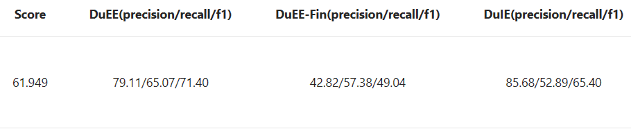

# Lit-IE

A easy-to-use library for information extraction based on [pytorch](https://github.com/pytorch/pytorch)
and [lightning](https://github.com/Lightning-AI/lightning)

## Requirements

```text
python3.8+
torch2+
lightning2+
transformers
```

## Datasets
- [CLUENER](https://github.com/CLUEbenchmark/CLUENER2020)
- [CMeEEv2](https://tianchi.aliyun.com/dataset/95414)
- [CMeIEv2](https://tianchi.aliyun.com/dataset/95414)
- [DuIEv2](https://aistudio.baidu.com/aistudio/competition/detail/46/0/task-definition)
- [DuEEv1](https://aistudio.baidu.com/aistudio/competition/detail/46/0/task-definition)
- [DuEE-fin](https://aistudio.baidu.com/aistudio/competition/detail/46/0/task-definition)

## Examples

### Train & Test

```shell
# do train/validate/test
CUDA_VISIBLE_DEVICES=0 python examples/example_CLUENER_GP.py fit \
--model.pretrained_model_name_or_path bert-base-chinese \
--data.train_data_path data/CLUENER/train.json \
--data.val_data_path data/CLUENER/dev.json \
--data.test_data_path data/CLUENER/test.json \
--data.train_batch_size 16 \
--data.eval_batch_size 64 \
--data.max_length 512 \
--trainer.max_epochs 10 \
--trainer.accumulate_grad_batches 1 \
--trainer.precision bf16-mixed \
--trainer.num_sanity_val_steps 0 \
--trainer.logger TensorBoardLogger \
--trainer.logger.save_dir checkpoints/CLUENER_GP \
--model_checkpoint.dirpath checkpoints/CLUENER_GP

# do test
CUDA_VISIBLE_DEVICES=0 python examples/example_CLUENER_GP.py test \
--model.pretrained_model_name_or_path bert-base-chinese \
--data.test_data_path data/CLUENER/test.json \
--data.eval_batch_size 16 \
--data.max_length 512 \
--trainer.precision bf16-mixed \
--model_checkpoint.dirpath  /dev/null \
--model.out_file_path cluener.json \
--ckpt_path PATH_TO_YOUR_CKPT_FILE
```

### CLUENER2020

| Model              | macro-p    | macro-r    | **macro-f1** | micro-p    | micro-r    | micro-f1   |
|--------------------|------------|------------|--------------|------------|------------|------------|
| bert-base + Linear | 0.7655     | 0.8019     | 0.7827       | 0.7595     | 0.8027     | 0.7805     |
| bert-base + CRF    | 0.7829     | 0.8003     | 0.7910       | 0.7778     | **0.8066** | 0.7919     |
| bert-base + GP     | 0.7910     | **0.8037** | 0.7967       | 0.7833     | 0.8047     | 0.7938     |
| bert-base + eGP    | **0.8043** | 0.7959     | **0.7991**   | **0.7977** | 0.8008     | **0.7992** |

### CMeEE-V2

| Model              | macro-p    | macro-r    | macro-f1   | micro-p    | micro-r    | **micro-f1** |
|--------------------|------------|------------|------------|------------|------------|--------------|
| bert-base + Linear | 0.6567     | 0.6737     | 0.6600     | 0.6807     | 0.6297     | 0.6542       |
| bert-base + CRF    | 0.6520     | 0.6649     | 0.6543     | 0.6762     | 0.6294     | 0.6520       |
| bert-base + GP     | **0.7457** | 0.7153     | **0.7293** | **0.7612** | 0.7212     | 0.7407       |
| bert-base + eGP    | 0.7111     | **0.7481** | 0.7272     | 0.7386     | **0.7439** | **0.7413**   |

### CMeIE-V2

| Model           | macro-p    | macro-r    | macro-f1 | micro-p    | micro-r    | **micro-f1** |
|-----------------|------------|------------|----------|------------|------------|--------------|
| bert-base + GP  | **0.5101** | 0.2731     | 0.3557   | **0.6206** | 0.3790     | 0.4706       |
| bert-base + eGP | 0.4715     | **0.2855** | 0.3557   | 0.6056     | **0.3979** | **0.4802**   |

### AIStudio-Information Extraction
Baseline: roberta-wwm-ext + GP

| Dev     | macro-p | macro-r | macro-f1 | micro-p | micro-r | micro-f1 |
|---------|---------|---------|----------|---------|---------|----------|
| DuIE-V2 | 0.7772  | 0.6792  | 0.7249   | 0.8014  | 0.7327  | 0.7655   |

| Dev      | arg-macro-p | arg-macro-r | arg-macro-f1 | arg-micro-p | arg-micro-r | arg-micro-f1 | event-macro-p | event-macro-r | event-macro-f1 | event-micro-p | event-micro-r | event-micro-f1 |
|----------|-------------|-------------|--------------|-------------|-------------|--------------|---------------|---------------|----------------|---------------|---------------|----------------|
| DuEEv1   | 0.6989      | 0.4499      | 0.5474       | 0.8041      | 0.5952      | 0.6840       | 0.3010        | 0.3221        | 0.3112         | 0.3608        | 0.3853        | 0.3726         |
| DuEE-fin | 0.7672      | 0.6409      | 0.6984       | 0.8415      | 0.7410      | 0.7881       | 0.2108        | 0.2684        | 0.2362         | 0.2194        | 0.3229        | 0.2613         |

